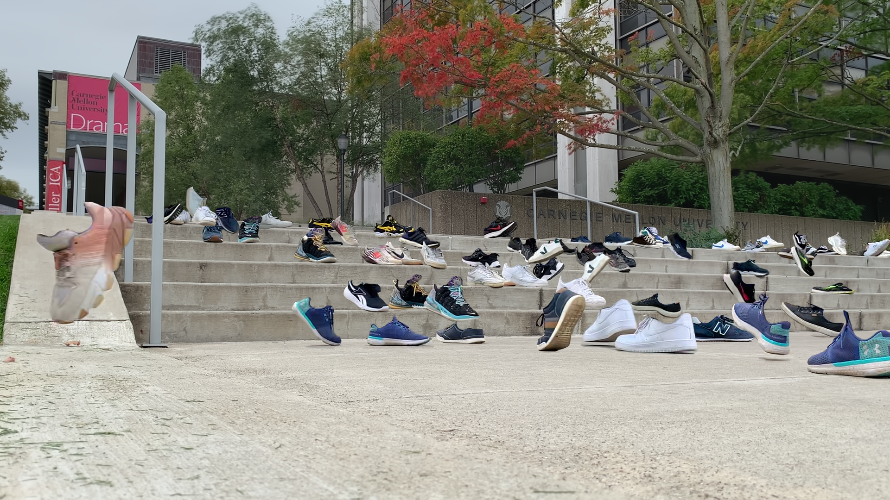
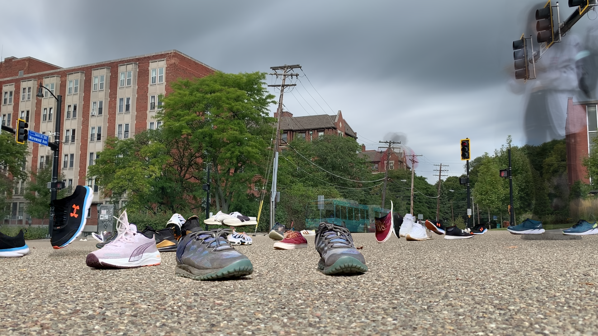
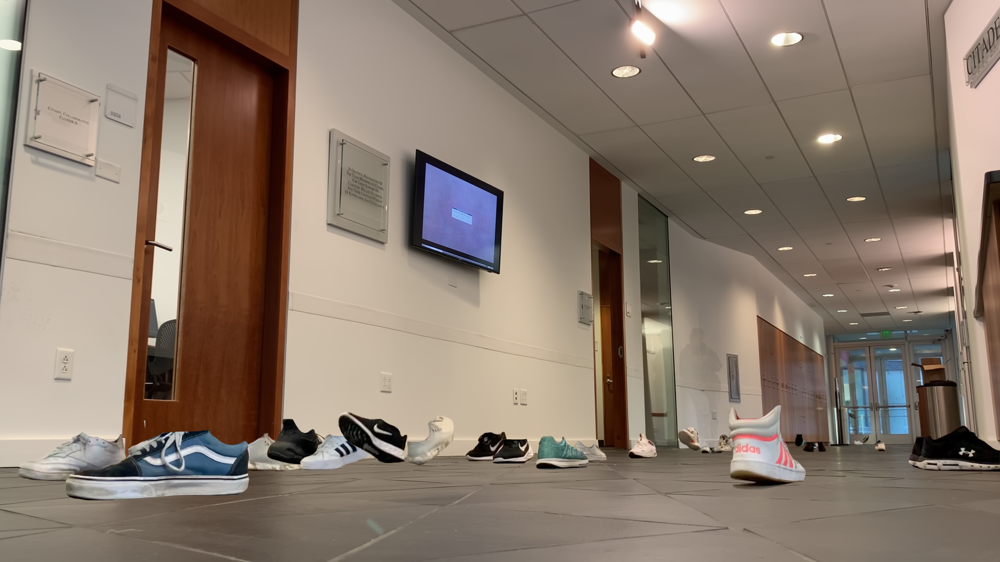

# Travel-Over-Time
ExCap project 1 : Typology

***Travel Over Time*** series captures a collection of passerby’s shoes observed over time at a location from a low angle in one frame. Each sneakers in the frame once was in that location at some time.

[doc](https://courses.ideate.cmu.edu/60-461/f2022/kitetale/09/29/kitetale-typology-machine/)

## How it started: ##

Curious of how the observation of the world differ from a viewpoint closer to the floor, I wanted to explore and capture the 'common' of the low perspective. I first recorded the small rover's point of view as it rolls across the road. Not so long after recording, I realized that I made an assumption that all visuals captured would have automatic stabilization like human eyes: All recordings I have made with the phone mounted on a rover had extreme motion blurs, as the rover rolled very close to the floor and doesn't have any shock absorption feature that would stabilize the camera.

Learnings from the first attempt: 

I was surprised to see the number of shoes and feet from the initial recordings. Sometimes the view captured was clear (like the snapshots above), and in these moments, there were shoes or animal feet in focus. Probably the camera autofocus algorithm in iPhone worked better when there's a clear outline of a target object, but these few snapshots made me wonder how many different sneakers would the camera be able to capture from a low angle at a given location over a defined time.

## Choices I made: ##

I chose sneakers because I personally like wearing sneakers the most and am more interested in seeing diverse designs of sneakers than those of other shoes type. Also, it is a great reference mark to indicate where people once were, as most of the time, everyone's shoes are located on or near the floor regardless of other personal features like height. I also decided to remove other part of the bodies and belongings other than sneakers to bring attention to the passing of time and diversity in the location where people choose to walk on a given pathway.

## Process: ##

Below describes the steps I initially planned to take to create Travel Over Time.

### Typology Machine Workflow: ###

Setup camera near the floor looking at the people path
Record for however long you'd like to
Extract each frame from the recordings and get the average visual of the frames using OpenCV  (Background extraction)
Train ML model to detect and categorize different sneakers

1. Scrape web to collect different sneakers images using Beautiful Soup
2. Categorize sneakers into 6 different groups : athletic, design, high-top, low-top, slip-on, street
3. Annotate each images to indicate where the sneakers are in the image
4. Use Cascade Classifier in OpenCV and TensorFlow to create/train a model
5. Extract sneakers from each frame using model
6. Additively overlay extracted sneakers on its position detected on frame on the background image created earlier

Since this was my first experience using OpenCV and ML models, I couldn't annotate all data in time to train my own sneakers detection model. I got the general object detection to work using pre-existing model online, but it was too general and wasn't as accurate to use for the project. Also, I noticed that additively overlaying the shoes detected would not give the clean imagery of multiple shoes walking across the same location all at once, as the sneakers would be detected as a box and overlay could include pieces of background within the detected box.

Instead, I followed steps below to create Travel Over Time:

1. Setup camera near the floor looking at the people path
2. Record for however long you'd like to
3. Extract each frame from the recordings and get the average visual of the frames using OpenCV  (Background extraction)
4. Import frames that have sneakers into Photoshop, delete pixels that aren't sneakers
5. Repeat until frames filled with as many sneakers as you want

## Evaluation & Reflection: ##

Last year, I have set myself a goal to learn new skills for each project I work on. I took this project as an opportunity to learn more about OpenCV and Machine Learning, which I'm happy of the knowledge I've acquired on them while investigating for this project.  Although I didn't get to fully complete model training section as planned, I know I can use the image labeling service in the future to get all images annotated to feed as training data.

I'm also happy with how the series turned out since each image captures different places the passerby have chosen to step on as they walk through the space. It was also interesting to see different sneakers designs people wear on campus. In the future series, I could further expand to show the path traces of each shoes by adding the combination of shoe movement trajectory instead of individual frame of shoes.ΩΩΩΩΩ
